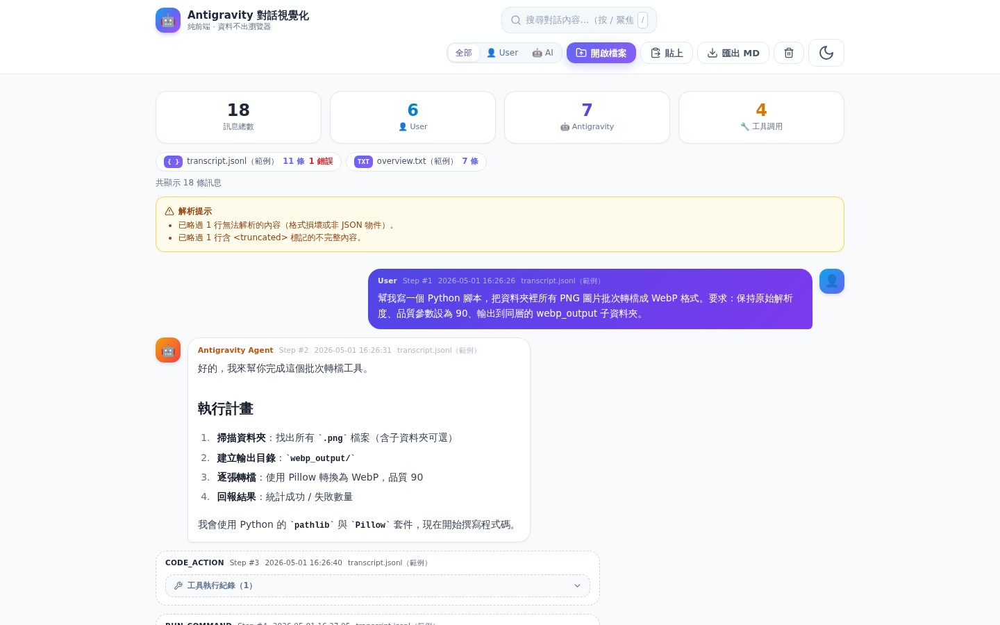

# 🤖 AGChatHistoryParser

**把 Google Antigravity 的對話日誌，變成清爽的聊天室介面。**

一個開源、純前端、隱私優先的單頁 Web 應用程式（SPA）。上傳或貼上 Antigravity 的 `transcript.jsonl` / `overview.txt`，立即渲染成通訊軟體風格的視覺化對話歷程。**所有解析皆在瀏覽器本機完成，任何資料都不會離開你的裝置。**



## ✨ 功能特性

| 功能 | 說明 |
|------|------|
| 📂 **雙格式解析** | 同時支援 `transcript.jsonl`（JSON Lines）與 `overview.txt`（純文字啟發式解析），自動嗅探格式 |
| 🗂️ **多檔案合併** | 可一次拖入多個檔案，全部解析後依 `step_index` 自動排序、重複內容自動去重 |
| 💬 **聊天室排版** | User 靠右、Antigravity Agent 靠左，附頭像、Step 序號、本機時間戳記與來源檔名 |
| 🧹 **資料清洗** | 自動擷取 `<USER_REQUEST>` 純文字、完全過濾 `<ADDITIONAL_METADATA>` 等環境雜訊 |
| 🔧 **工具折疊框** | `write_to_file`、`run_command` 等工具調用預設折疊，點開可看名稱、參數與執行結果（含語法高亮） |
 | 📝 **完整 Markdown** | AI 回覆支援粗體、清單、表格、程式碼區塊渲染，程式碼具語法高亮與一鍵複製 |
| 🔍 **搜尋與過濾** | 關鍵字即時搜尋並高亮命中內容；可篩選只看 User / 只看 AI |
| 📤 **Markdown 匯出** | 一鍵匯出乾淨的 `conversation.md` 逐字稿（保留對話格式） |
| 🌓 **明暗主題** | 跟隨系統偏好，一鍵切換 Light / Dark Mode（含語法高亮主題同步切換） |
| 🛡️ **容錯解析** | 空行、格式損壞的 JSON、含 `<truncated N bytes>` 的行會溫和跳過並標示，绝不中斷整體解析 |

## 🚀 使用方式

**線上版（GitHub Pages）：**

> https://michelleeechan.github.io/AGChatHistoryParser/

**本機執行：** 直接用瀏覽器打開 `index.html`，或：

```bash
python3 -m http.server 8080
# 開啟 http://localhost:8080
```

## 📂 Chat History 檔案位置

Antigravity 的對話日誌存放在（Windows）：

```
C:\Users\<使用者名稱>\.gemini\antigravity\brain\<對話 ID>\.system_generated\logs
```

每個 `brain` 子資料夾對應一場對話，內含 `transcript.jsonl` 與 `overview.txt` 等檔案——可以一次全選拖進本工具。

## 📥 支援格式與解析規則

### `transcript.jsonl`（JSON Lines）

每行一個獨立 JSON 物件，常見欄位：

| 欄位 | 說明 |
|------|------|
| `step_index` | 步驟流水號（多檔案合併時的排序依據） |
| `source` | `USER_EXPLICIT` / `MODEL` |
| `type` | `USER_INPUT` / `PLANNER_RESPONSE` / `VIEW_FILE` / `CODE_ACTION` 等 |
| `created_at` | ISO 8601 時間字串 |
| `content` | 文字內容 |
| `tool_calls` | 工具調用陣列（選填） |

**資料清洗規則：**

1. **使用者發言**：優先以正則擷取 `<USER_REQUEST>...</USER_REQUEST>` 內的純文字；完全過濾 `<ADDITIONAL_METADATA>`、`<USER_SETTINGS_CHANGE>` 等環境雜訊；找不到標籤則保留剔除雜訊後的原文。
2. **AI 回覆**：`PLANNER_RESPONSE` 內容為標準 Markdown，完整渲染。
3. **工具調用**：不當作聊天气泡主文字，渲染為可收摺的工具執行折疊框。
4. **時間戳記**：`created_at` 轉換為瀏覽器本機時區的 `YYYY-MM-DD HH:mm:ss`。

### `overview.txt`（純文字）

採啟發式解析，支援的行格式：

```
[Step 13] User (2026-05-01 16:35:02):
訊息內容…

[Step 14] Antigravity Agent:
回覆內容…
```

- 說話者前綴：`User` / `使用者` / `Agent` / `Antigravity` / `Gemini` 等
- 步驟標記：`[Step N]`、`[N]`、`Step N:`（可獨立成行）
- 時間戳記：`YYYY-MM-DD HH:mm:ss` 或 ISO 8601（可選）
- 完全沒有結構時，整份檔案以「文件卡」模式顯示

> 💡 TXT 為啟發式解析，若你的 `overview.txt` 格式不同導致解析異常，歡迎開 Issue 附上脱敏樣本。

## 🔒 隱私說明

- **零後端、零上傳**：解析、渲染、搜尋、匯出全部在瀏覽器本機完成
- 不使用任何分析追蹤服務；外部資源僅 CDN 函式庫（Tailwind / Marked / DOMPurify / highlight.js / Lucide）
- 對話內容經 DOMPurify 淨化後渲染，防止日誌中的惡意 HTML

## 🛠️ 技術棧

- **UI**：原生 HTML / CSS / JavaScript + [Tailwind CSS](https://tailwindcss.com)（CDN）
- **Markdown**：[Marked.js](https://marked.js.org) + [DOMPurify](https://github.com/cure53/DOMPurify)
- **語法高亮**：[highlight.js](https://highlightjs.org)
- **圖示**：[Lucide Icons](https://lucide.dev)
- **部署**：GitHub Pages（靜態託管）

## 📁 專案結構

```
AGChatHistoryParser/
├── index.html                  # 單頁應用進入點
├── assets/
│   ├── style.css               # 自訂樣式（氣泡、折疊框、高亮…）
│   ├── parser.js               # 核心解析引擎（JSONL / TXT / 合併排序 / MD 匯出）
│   └── app.js                  # UI 邏輯（渲染、搜尋、上傳、主題…）
├── sample/
│   ├── transcript.sample.jsonl # 範例對話（Step 1–12）
│   └── overview.sample.txt     # 範例對話續篇（Step 13–18，示範多檔合併）
├── docs/                       # 截圖
└── .nojekyll                   # 跳過 Jekyll 處理
```

## 🧪 開發

解析引擎為零依賴純 JS，可直接以 Node.js 執行測試：

```bash
node scripts/test_parser.js   # 43 項斷言測試
```

## 📄 授權

[MIT License](LICENSE)
